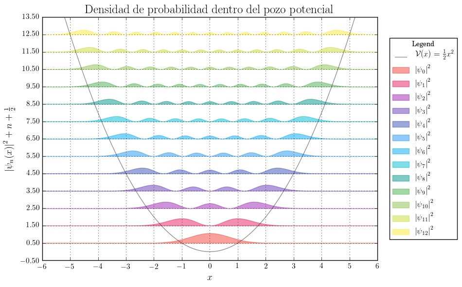

# Arduino Serial Monitor

[][1]
[![BSD 3 Clause License][2]][1] [![Python][3]][1] [![Arduino languaje][4]][1] [![PyQt][5]][1] [![Physics Intrumentation][6]][1] [![Electronics][7]][1] [![Arduino][8]][1] [![Real time][9]][1]


Sample graphical user inteface to real time monitoring sensor signals interfaced with Arduino :smile:

This program was developed as part of Phisical Instrumentaion course at the Major National University of San Marcos, Lima, Peru.

## How to use

1. Clone the repository
    ```
    git clone https://github.com/zodiacfireworks/arduino-serial-monitor.git
    ```

2. Install the depenedencies. (Is recomendable use conda)
    ```
    conda create -n arduino-serial-monitor python=3 ncurses matplotlib
    source activate arduino-serial-monitor
    pip install pyqt5 --upgrade --force-reinstall
    ```

3. Enter to the application diretory and execute the program
    ```
    cd arduino-serial-monitor/arduino-serial-monitor
    python asm5_main.py
    ```

4. Waits until the UI loads and use intuitively :sweat_smile:

5. All the arduino stuff is in `sensors` directory, load the sketchs to your arduino before to use the interface.

## Author

* [@zodiacfireworks](https://github.com/zodiacfireworks)

## Licensing

All resources developed by me in this repository is released under the BSD-3-Clause license.

Resource with its respective licences are protectect by them.

If you find copyright protected content or without its respective credits,
please let us know to give the respective credits and to put the things in
order according to laws.

[1]: git@github.com:zodiacfireworks/meteorological-faker.git
[2]: https://img.shields.io/badge/License-BSD%203%20Clause-blue.svg?maxAge=2592000&style=flat-square
[3]: https://img.shields.io/badge/Language-Python-green.svg?maxAge=2592000&style=flat-square
[4]: https://img.shields.io/badge/Language-Arduino-green.svg?maxAge=2592000&style=flat-square
[5]: https://img.shields.io/badge/Tool-PyQt-green.svg?maxAge=2592000&style=flat-square
[6]: https://img.shields.io/badge/Topic-Physical%20intrumentation-green.svg?maxAge=2592000&style=flat-square
[7]: https://img.shields.io/badge/Topic-Electronics-green.svg?maxAge=2592000&style=flat-square
[8]: https://img.shields.io/badge/Topic-Arduino-green.svg?maxAge=2592000&style=flat-square
[9]: https://img.shields.io/badge/Topic-Real%20Time-green.svg?maxAge=2592000&style=flat-square
